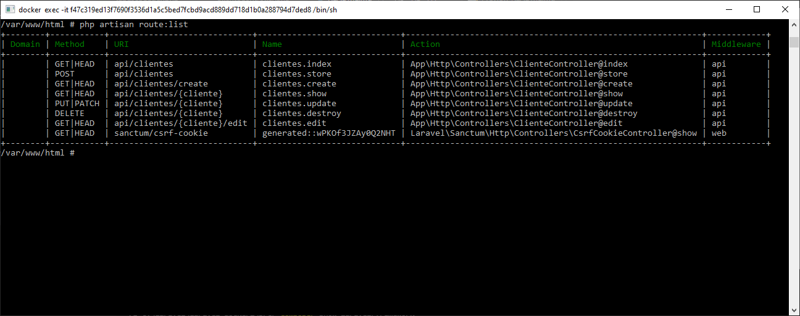
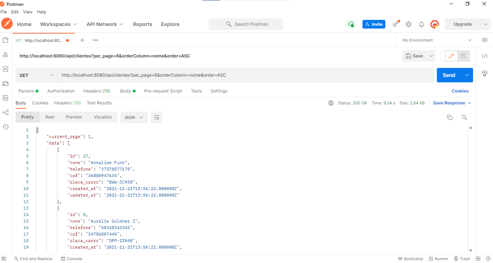

# Cadastro de Clientes


## Sobre <a name = "about"></a>

Projeto de uma API REST em PHP com framework Laravel, que permite criar, ler, atualizar e excluir (GET​, ​POST​, ​PUT​,DELETE​) registros em um banco de dados e configuração do docker

Pode-se criar, editar e excluir os clientes.





## Inicio <a name = "getting_started"></a>

Projeto desenvolvido em PHP v7.4, Laravel v8.73.


### API endpoints
```
GET /clientes
Codes 200
Retorna todos os clientes
```
```
GET /clientes?per_page=6&orderColumn=nome&order=ASC
Codes 200 / 404
Retorna os clientes de acordo com os parametros de paginação
```
```
GET /clientes/{id}
Codes 200 / 404
Retorna os dados de um cliente
```
```
POST /clientes
Codes 201 / 400
Adiciona um novo cliente
```
```
PUT /clientes/{id}
Codes 200 / 400
Atualiza os dados de um cliente
```
```
DELETE /clientes/{id}
Codes 204 / 400
Apaga o registro de um cliente
```

### Instalação Docker
- Clone o repositório com __git clone__ executando o comando:
```
git clone https://github.com/gilcleis/laravel_api_clientes.git

```
- ecesse o direrorio /laravel_api_clientes:
```
cd laravel_api_clientes
```
- Execute o comando:
```
docker-compose up -d
```
- Execute o comando:
```
docker-compose exec php cp /var/www/html/.env.example /var/www/html/.env 
```
- configure as credencias de banco de dados no arquivo __.env__

```
DB_CONNECTION=mysql
DB_HOST=mysql
DB_PORT=3306
DB_DATABASE=laravel
DB_USERNAME=root
DB_PASSWORD=laravel

```


- Execute o comando:
```
docker-compose exec php composer install
```
- Execute o comando:
```
docker-compose exec php php /var/www/html/artisan  key:generate
```
- Execute o comando:
```
docker-compose exec php php /var/www/html/artisan  migrate:fresh --seed
```

- Acessar o endereço
```
http://127.0.0.1:8080/api/clientes
```
### Instalação Manual

- Clone o repositório com __git clone__ executando o comando:
```
git clone https://github.com/gilcleis/laravel_api_clientes.git
```
- Acesse o diretorio criado
- Crie uma copia do arqruivo __.env.example__ nomeando para __.env__ 

- configure as credencias de banco de dados no arquivo __.env__

```
DB_CONNECTION=mysql
DB_HOST=mysql
DB_PORT=3306
DB_DATABASE=laravel
DB_USERNAME=root
DB_PASSWORD=laravel
```


- Execute o comando:

```
php artisan key:generate
```
- Execute o comando:

```
php artisan migrate --seed
```

- Pronto, inicie o URL principal ou:
```
php artisan serve
```

